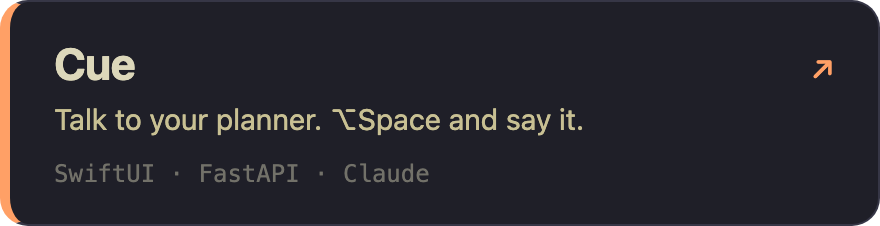
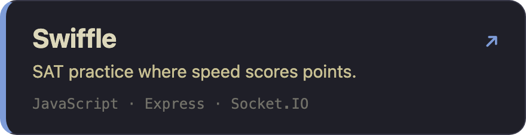
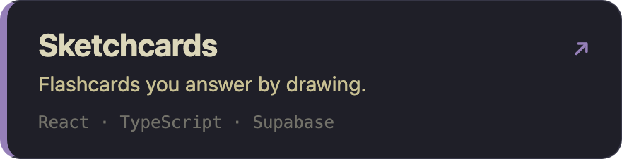
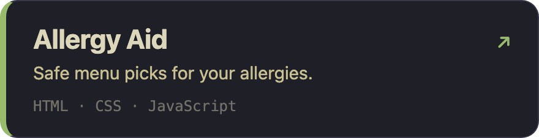

  

  

### things I've shipped

<table>
  <tr>
    <td width="50%"></td>
    <td width="50%"></td>
  </tr>
  <tr>
    <td width="50%"></td>
    <td width="50%"></td>
  </tr>
</table>

### contact me

📫 [cjimmy@engineering.upenn.edu](mailto:cjimmy@engineering.upenn.edu)
